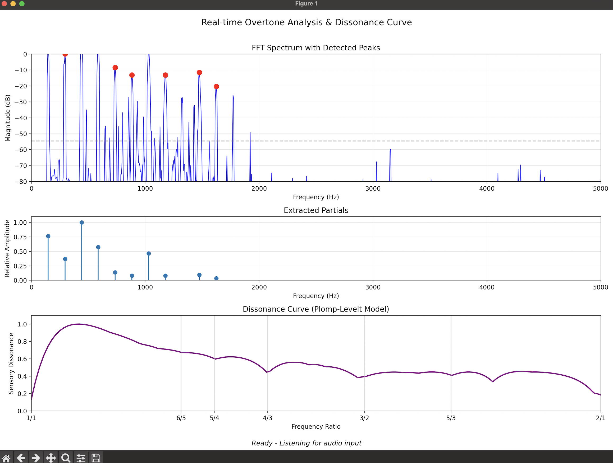

# Real-time Overtone Extraction and Dissonance Curve Visualization.

A small Python applet that captures audio input from a microphone and visualizes
dissonance curves based on the detected overtone frequencies.
This is a quick demo that works ok with my Macbook and guitar.
Results may vary with microphone quality and environment noise.
I'm curious to see if it works with other instruments as well!



## Usage

Using [uv](https://github.com/astral-sh/uv/) to run the script:

```bash
uv run dissonance_curves.py              # Use default microphone
uv run dissonance_curves.py -d 1         # Use specific device
uv run dissonance_curves.py --list-devices
```

## Taming Noise

Depending on your microphone quality and environment noise, you may need to adjust
the noise threshold multiplier in the `compute_noise_threshold` function in the
`dissonance_curves.py` file. I also implemented exponential smoothing of nearby
FFT frames to help stabilize the analysis, but it reduces latency.

## References

- Minute physics video on dissonance curves: https://youtu.be/tCsl6ZcY9ag?t=464
- Dissonance curves: https://en.wikipedia.org/wiki/Dissonance_curve
- Audio input with sounddevice: https://python-sounddevice.readthedocs.io/en/0.4.6/
